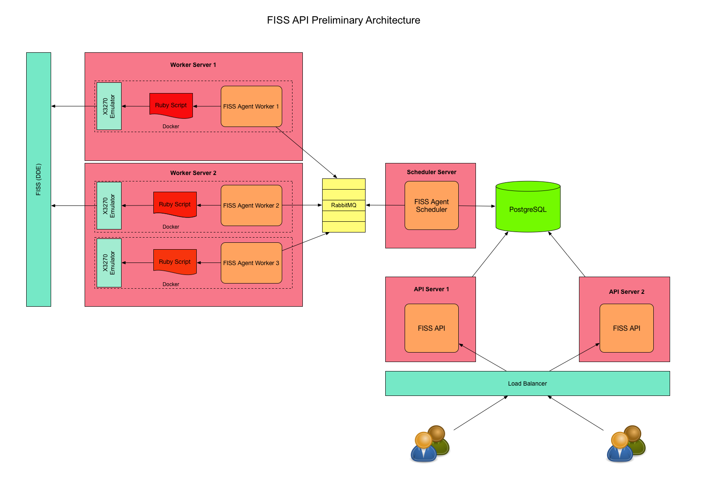

# mis-common
Screen Scrape Project - shared libraries
## Proposed Architecture

The diagram shown above describes the proposed architecture for the MIS Screen Scrape application.  Unlike the initial Ruby on Rails implementation, this incarnation of the application will focus on meeting the scalability and performance needs of potentially thousands of concurrent users.  This is achieved by ensuring that the DDE system is accessed asynchronously relative to the user-facing APIs.  

An FISS Agent system consisting of a scheduler and multiple workers will effectively crawl the DDE system at fixed intervals, reading claims from the DDE system and storing these in a relational database. The user facing APIs will read data from the RDB instead of directly from the DDE system, thereby minimizing the latency of the reads and improving the scalability of the system as a whole.  

Updates to the DDE system will flow in the opposite direction.  The API layer will store updates to the relational database. For each update, a corresponding transaction will also be recorded with the database.  At fixed intervals, the scheduler will read all outstanding transactions from the database and push them to the workers for processing.  The workers, in turn, will push these updates to the DDE system.  As with the reads, this ensures that API latency is minimized while maximizing the scalability of the system.

### Architecture - Open Questions
A number of questions exist which may result in changes to this architecture.  Specifically, the architecture leverages a standalone Ruby script containing the same Ruby code that was used within the preliminary implementation in order to interface with the X3270 emulator. It is currently not clear whether each worker will need to spawn its own instance of an X3270 emulator, or whether the X3270 can behave as an external service capable of processing requests from multiple workers at the same time. The performance characteristics of having multiple workers each executing multiple instances of the same Ruby script is another open question and may lead to a re-examination of the architecture.   

EDIT: It turns out that each worker will need to spawn its own instance of an X3270 emulator.  As such, the worker infrastructure makes a good candidate for Dockerization.  This has all been reflected in the latest architecture diagram.

